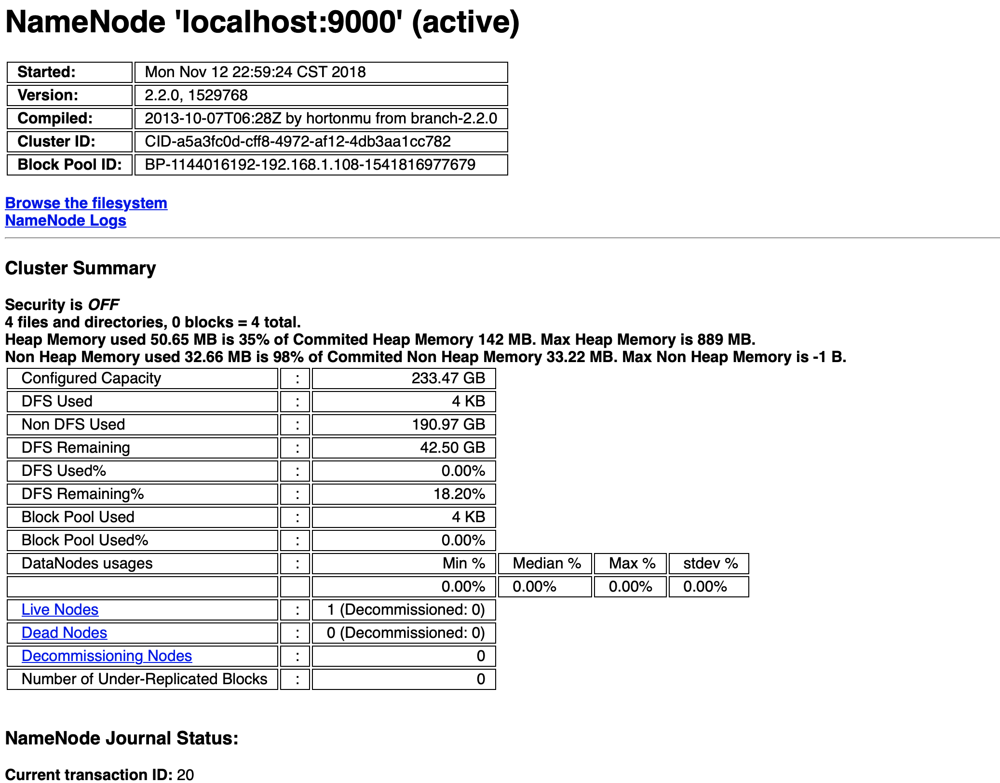
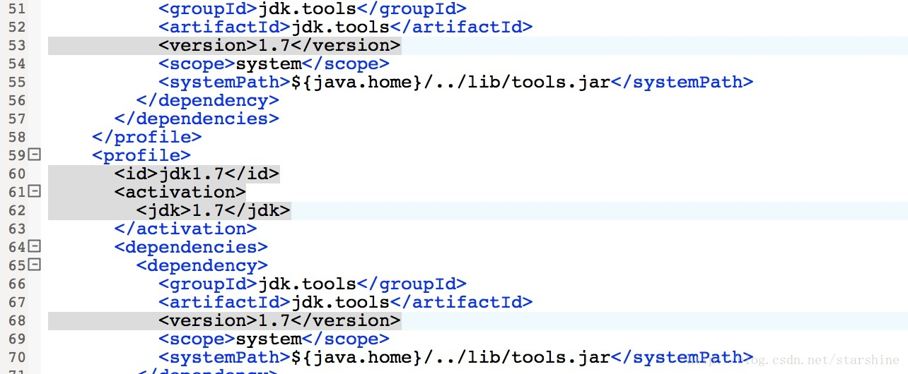
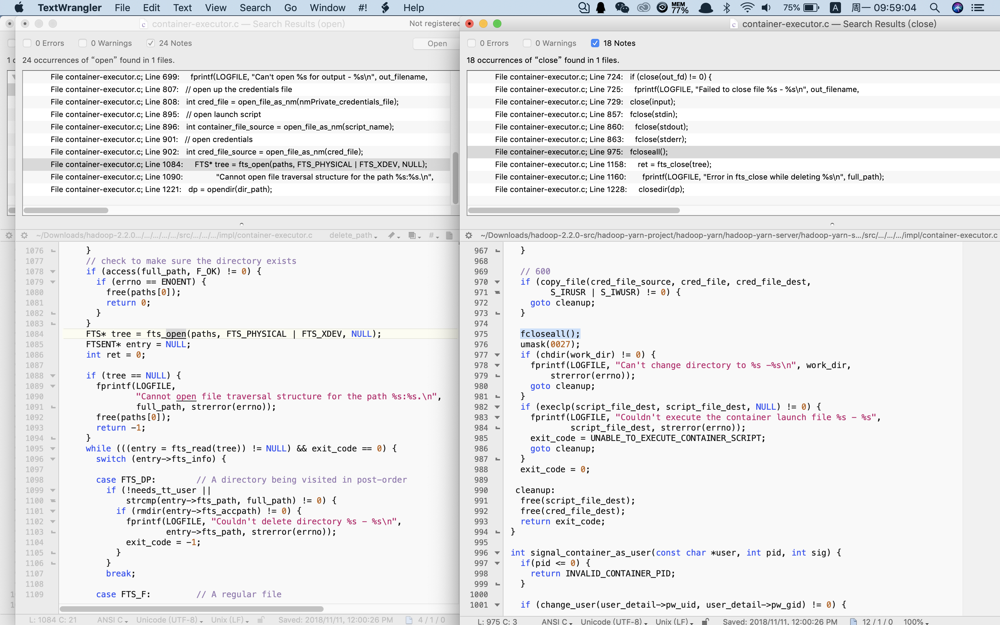

#<center>实验报告</center>
###1.安装Hadoop
####1.1.原理简述
Hadoop是一个由Apache基金会所开发的分布式系统基础架构。用户可以在不了解分布式底层细节的情况下，开发分布式程序。充分利用集群的威力进行高速运算和存储。Hadoop的框架最核心的设计就是：HDFS和MapReduce。HDFS为海量的数据提供了存储，而MapReduce则为海量的数据提供了计算。

<center>


<font color='DarkGray'>集群系统示意图</font>
</center>

正如前几次实验中的，Linux虚拟机在我的Mac上运行实在太慢，并且考虑到Mac也是类Unix系统，所以我暂时没有使用虚拟机，项目都在Mac环境下运行。也因此，Mac上的安装都需要自己摸索。而这次Hadoop在Mac上的安装费尽周折，并且遇到网上没有先例的问题（由于编译版本不同）、包括Hadoop2.2.0源码中的许多bug。

在此将我的安装过程记录下来，或许对后人有用。

环境: 
`MacOS-10.14`, `java-1.7.0_80`, `cmake3.13.0-rc3` with `clang-1000.10.44.4`, `Maven 3.6.0`, `protocbuf 2.5.0`.

参考：
[hadoop2.2.0 centos 编译安装详解](https://blog.csdn.net/w13770269691/article/details/16883663/), [hadoop2.2.0 版本编译64位native库的问题](https://www.cnblogs.com/kaisne/p/3639070.html), [mac下hadoop环境的搭建以及碰到的坑点](https://blog.csdn.net/chenxun_2010/article/details/78238251),[mac下hadoop 2.6.0编译native library](https://blog.csdn.net/tterminator/article/details/51779689), [重新编译hadoop 32bit-64bit](http://blog.sina.com.cn/s/blog_6baac06c0101gvxr.html), [Running Hadoop On OS X 10.5 64-bit_(Single-Node_Cluster)](https://wiki.apache.org/hadoop/Running_Hadoop_On_OS_X_10.5_64-bit_(Single-Node_Cluster)), [HOW TO SETUP HADOOP ON MAC OS X 10.9 MAVERICKS](http://shayanmasood.com/blog/how-to-setup-hadoop-on-mac-os-x-10-9-mavericks/), [Undefined symbols for architecture x86_64: “_fcloseall”](https://stackoverflow.com/questions/53248756/undefined-symbols-for-architecture-x86-64-fcloseall)


****
####1.2.Mac上安装Hadoop2.2.0


+ **ssh配置**

单机上用Hadoop要配置伪分布式环境，则需要使用远程登录，所以先确认能够远程登录：
`系统偏好设置-共享-远程登录`，然后在终端运行

```python
ssh-keygen -t rsa
cat ~/.ssh/id_rsa.pub >> ~/.ssh/authorized_keys
chmod og-wx ~/.ssh/authorized_keys	
ssh localhost
```
这样就创建了ssh的localhost登录方式。然而我在运行时出现了权限问题，经查资料，应该检查.ssh的父目录的文件权限并执行`chmod 775 ~/.ssh`。

-
+ **安装配置Hadoop文件**

首先在Apache官网上下载`hadoop-2.2.0.tar.gz`，解压后进入文件夹，在目录下的`etc/hadoop`中，进行以下文件的修改：

1.`core-site.xml`

```html
<configuration>  
    <!-- 指定HDFS老大（namenode）的通信地址 -->  
    <property>  
        <name>fs.defaultFS</name>  
        <value>hdfs://localhost:9000</value>  
    </property>  
    <!-- 指定hadoop运行时产生文件的存储路径 -->  
    <property>  
        <name>hadoop.tmp.dir</name>  
        <value>/Users/markdana/hadoop-2.2.0/temp</value>  
    </property>  
</configuration>
```

2.`hdfs-site.xml`

默认副本数3，修改为1。`dfs.namenode.name.dir`指明fsimage存放目录，多个目录用逗号隔开。`dfs.datanode.data.dir`指定块文件存放目录，多个目录逗号隔开。

```html
<configuration>
<property>  
        <name>dfs.replication</name>  
        <value>1</value>  
    </property>  
    <property>  
        <name>dfs.namenode.name.dir</name>  
       <value>file:/Users/markdana/hadoop-2.2.0/temp/hdfs/name</value>  
    </property>  
    <property>  
        <name>dfs.datanode.data.dir</name>  
          <value>file:/Users/markdana/hadoop-2.2.0/temp/hdfs/data</value>  
    </property>  
    <property>  
        <name>dfs.namenode.secondary.http-address</name>  
        <value>localhost:9001</value>  
    </property>  
    <property>  
      <name>dfs.webhdfs.enabled</name>  
      <value>true</value>  
    </property> 
</configuration>
```
3.配置yarn，

`mapred-site.xml`:

```html
<configuration>
<property>  
        <name>mapreduce.framework.name</name>  
        <value>yarn</value>  
    </property>  
    <property>  
        <name>mapreduce.admin.user.env</name>  
        <value>HADOOP_MAPRED_HOME=$HADOOP_COMMON_HOME</value>  
    </property>  
    <property>  
        <name>yarn.app.mapreduce.am.env</name>  
        <value>HADOOP_MAPRED_HOME=$HADOOP_COMMON_HOME</value>  
    </property> 

    <property>
  <name>mapreduce.application.classpath</name>
  <value>
      /Users/markdana/hadoop-2.2.0/etc/hadoop,
      /Users/markdana/hadoop-2.2.0/share/hadoop/common/*,
      /Users/markdana/hadoop-2.2.0/share/hadoop/common/lib/*,
      /Users/markdana/hadoop-2.2.0/share/hadoop/hdfs/*,
      /Users/markdana/hadoop-2.2.0/share/hadoop/hdfs/lib/*,
      /Users/markdana/hadoop-2.2.0/share/hadoop/mapreduce/*,
      /Users/markdana/hadoop-2.2.0/share/hadoop/mapreduce/lib/*,
      /Users/markdana/hadoop-2.2.0/share/hadoop/yarn/*,
      /Users/markdana/hadoop-2.2.0/share/hadoop/yarn/lib/*
  </value>
</property>
</configuration>
```
`yarn-site.xml`:

```html
<configuration>
<!-- Site specific YARN configuration properties -->
    <property>  
        <name>yarn.nodemanager.aux-services</name>  
        <value>mapreduce_shuffle</value>  
    </property>
    <property>
    <name>yarn.application.classpath</name>
    <value>
        /Users/markdana/hadoop-2.2.0/etc/hadoop,
        /Users/markdana/hadoop-2.2.0/share/hadoop/common/*,
        /Users/markdana/hadoop-2.2.0/share/hadoop/common/lib/*,
        /Users/markdana/hadoop-2.2.0/share/hadoop/hdfs/*,
        /Users/markdana/hadoop-2.2.0/share/hadoop/hdfs/lib/*,
        /Users/markdana/hadoop-2.2.0/share/hadoop/mapreduce/*,
        /Users/markdana/hadoop-2.2.0/share/hadoop/mapreduce/lib/*,
        /Users/markdana/hadoop-2.2.0/share/hadoop/yarn/*,
        /Users/markdana/hadoop-2.2.0/share/hadoop/yarn/lib/*
    </value>
  </property>
</configuration>
```
-
+ **配置Hadoop环境变量**

`vim ~/.bash_profile`在环境变量中添加：

```python
export HADOOP_HOME=/Users/markdana/hadoop-2.2.0
export PATH=$PATH:$HADOOP_HOME/sbin:$HADOOP_HOME/bin

export  LD_LIBRARY_PATH=$HADOOP_HOME/lib/native/
export  HADOOP_COMMON_LIB_NATIVE_DIR=$HADOOP_HOME/lib/native
export  HADOOP_OPTS="-Djava.library.path=$HADOOP_HOME/lib/native:$HADOOP_COMMON_LIB_NATIVE_DIR"
```
按照网络教程的说法，到这一步配置基本完成，没什么问题了，应该可以直接开始运行Hadoop了。这时我也可以正常打开hdfs管理界面和hadoop进程管理界面等：
<center>


<font color='DarkGray'>在loclahost查看hdfs</font>
</center>
于是按照PPT上的教程，创建目录、写新文件、统计词频等操作，然而却报错`Unable to load native-hadoop library for your platform`。经过查资料得知，运行hadoop需要用到`native library`动态库，而在官网上明确说明：
>The pre-built 32-bit i386-Linux native hadoop library is available as part of the hadoop distribution and is located in the lib/native directory. You can download the hadoop distribution from Hadoop Common Releases.
>
>The native hadoop library is supported on *nix platforms only. The library **does not** to work with Cygwin or the **Mac OS X** platform.

在官网下载的Hadoop版本中自带的`native library`只针对32位Linux。**不适用于Mac OS X**。因此我必须要在Mac下重新编译`native library`。现在我们将迎来整个安装过程中最坑爹的部分。

****
####1.3.Mac上编译`native library`


+ **准备编译环境**

0.下载hadoop2.2.0的二进制源码，解压成文件夹`hadoop-2.2.0-src`

1.安装cmake
>没有版本要求

2.安装protoc
>版本必须是2.5.0，否则编译失败。网上说不能用brew install protobuf的方式安装，因为该方式安装的版本不一定是2.5.0，需要自己下源码编译。
>
我的做法是先`brew search protobuf`，找到需要的版本后，`brew install protobuf@2.5` ,再配置环境变量：
>
```python
export PROTOBUF=/usr/local/Cellar/protobuf@2.5/2.5.0
export PATH=$PROTOBUF/bin:$PATH
```
>为了编译器能找到protobuf还需要设置：
>
```python
export LDFLAGS="-L/usr/local/opt/protobuf@2.5/lib"
export CPPFLAGS="-I/usr/local/opt/protobuf@2.5/include"
```
>证明也是可行的。

3.安装maven
>我使用的Apache Maven 3.6.0，设置环境变量
>
```
export M2_HOME=/Users/markdana/apache-maven-3.6.0
exxport PATH=$M2_HOME/bin:$PATH
```

4.创建Java软链接
>编译过程中报错`Missing tools.jar`，是由于Linux系统中默认储存`tools.jar`的路径和Mac中不同。根据Building.txt要求，设置`JAVA_HOME`是`....jdk/Contents/Home`的Java路径，在其中创立`Classes`文件夹，并执行
>
```html
sudo ln -s $JAVA_HOME/lib/tools.jar $JAVA_HOME/Classes/classes.jar`
```
>创建软链接就不会找不到文件了。另外，关于`JAVA_HOME`的设置，后续还会提起。

-
+ **开始编译**

进入源码根目录中，执行

```python
mvn package -Pdist,native -DskipTests -Dtar
```
期望的结果是经过漫长编译后，全部BUILD SUCCESS，然后将编译出的`native library`库（路径`hadoop-2.2.0-src/hadoop-dist/target/hadoop-2.2.0/lib/native`）替换到之前安装的hadoop的库目录中（路径`hadoop-2.2.0/lib/native`）。然而，一共54个编译项目，出现的WARNING可以不管，但任何一个有ERROR都会在该处卡住，需要debug后才能往下跑通。

-

+ **Apache Hadoop Annotations编译失败**

报错是关于Java的，比如：

```python
..tools/RootDocProcessor.java:[20,22] 错误: 程序包com.sun.javadoc不存在
```
```
..tools/RootDocProcessor.java:[55,16] 错误: 找不到符号
```
在之前已经设置了Java的软链接，那为什么找不到程序包呢？难道是本机安装的脚步问题？于是进入`hadoop-2.2.0-src/hadoop-common-project/hadoop-annotations`中查看POM文件，发现其指定的JDK是1.7，而我使用的是1.8，需要手动将1.7改成1.8，如下图：
<center>

</center>

重新编译，问题解决。 

也就是说，Hadoop源码的pom文件中，对Java的版本进行了固化，而不是动态根据识别当前环境的Java版本。想到此，考虑到是否还有其他pom文件里面对也有这种Java版本固化声明呢？

对`requireJavaVersion`语句进行查询。运行：

``` python
find . -name pom.xml |xargs grep requireJavaVersion
```
结果发现以下pom文件中都需要修改jdk至1.8：

```python
./hadoop-assemblies/pom.xml: 
./hadoop-assemblies/pom.xml: 
./hadoop-project/pom.xml: 
./hadoop-project/pom.xml: 
./pom.xml: 
./pom.xml: 
```
-
+ **Apache Hadoop Maven Plugins编译失败**

仍然是关于Java运行的错误：

```python
[ERROR] Failed to execute goal org.apache.maven.plugins:maven-javadoc-plugin:2.8.1:jar (module-javadocs) on project hadoop-maven-plugins: MavenReportException: Error while creating archive: 
[ERROR] Exit code: 1 - /Users/markdana/Downloads/hadoop-2.2.0-src/hadoop-maven-plugins/src/main/java/org/apache/hadoop/maven/plugin/util/Exec.java:47: 错误: 未知标记: String
[ERROR]    * @param command List<String> containing command and all arguments
[ERROR]                         ^
[ERROR] /Users/markdana/Downloads/hadoop-2.2.0-src/hadoop-maven-plugins/src/main/java/org/apache/hadoop/maven/plugin/util/Exec.java:48: 错误: 未知标记: String
[ERROR]    * @param output List<String> in/out parameter to receive command output
[ERROR]                        ^
[ERROR] /Users/markdana/Downloads/hadoop-2.2.0-src/hadoop-maven-plugins/src/main/java/org/apache/hadoop/maven/plugin/util/FileSetUtils.java:52: 错误: 未知标记: File
[ERROR]    * @return List<File> containing every element of the FileSet as a File
[ERROR]                  ^
[ERROR] 
[ERROR] Command line was: /Library/Java/JavaVirtualMachines/jdk1.8.0_131.jdk/Contents/Home/bin/javadoc @options @packages
[ERROR] 
[ERROR] Refer to the generated Javadoc files in '/Users/markdana/Downloads/hadoop-2.2.0-src/hadoop-maven-plugins/target' dir.
```
也就是处理`String`,`File`等对象时出现bug。查资料后发现，这是由于Java1.7和Java1.8中部分语法做了更新。为了使这里运行通过，我只能使用Java1.7.也难怪会在POM中进行Java的版本固化。

于是将上一步做的调整全部调回来，并且下载Java1.7的jdk安装到本地（别忘了创建软链接）。那么以后如何在不同版本的Java之间切换呢？在环境变量中添加：

```python
export JAVA_6_HOME=/Library/Java/JavaVirtualMachines/1.6.0.jdk/Contents/Home
export JAVA_7_HOME=/Library/Java/JavaVirtualMachines/jdk1.7.0_80.jdk/Contents/Home
export JAVA_8_HOME=/Library/Java/JavaVirtualMachines/jdk1.8.0_131.jdk/Contents/Home
alias jdk1.6='export JAVA_HOME=$JAVA_6_HOME'
alias jdk1.7='export JAVA_HOME=$JAVA_7_HOME'
alias jdk1.8='export JAVA_HOME=$JAVA_8_HOME'

#use java7 default
export JAVA_HOME=$JAVA_7_HOME
export CLASSPAHT=.:$JAVA_HOME/lib/dt.jar:$JAVA_HOME/lib/tools.jar
export PATH=$JAVA_HOME/bin:$PATH:
```

这样就可以通过诸如命令`jdk1.8`使用Java1.8了。而在接下来的实验中，都使用的Java1.7。本条编译通过。

-
+ **Apache Hadoop Common编译失败**

首先是发现maven编译时下载包比较慢。为了提速，添加国内的阿里云镜像源，感谢阿里云。即在maven根目录下的`conf`文件夹中的`setting.xml`文件添加：

```html
<mirrors>
<mirror>
  <id>alimaven</id>
  <name>aliyun maven</name>
  <url>http://maven.aliyun.com/nexus/content/groups/public/</url>
  <mirrorOf>central</mirrorOf>        
</mirror>
</mirrors>
```
然后运行，报错如下。

```python
The C compiler identification is unknown
The CXX compiler identification is unknown
Check for working C compiler: /usr/bin/cc
CMake Error at /Applications/CMake.app/Contents/share/cmake-3.13/Modules/CMakeTestCCompiler.cmake:52 (message):
The C compiler

"/usr/bin/cc" is not able to compile a simple test program.
It fails with the following output:
Change Dir: /Users/markdana/Downloads/hadoop-2.2.0-src/hadoop-common-project/hadoop-common/target/native/CMakeFiles/CMakeTmp
Run Build Command:"/usr/bin/make" "cmTC_88f64/fast"
xcrun: error: invalid active developer path (/Library/Developer/CommandLineTools), missing xcrun at: /Library/Developer/CommandLineTools/usr/bin/xcrun
```

经分析是cmake的编译器路径出现错误。更新了Mojave系统后我刚更新了Xcode，可能相关组件出现问题。查看路径`/Library/Developer/CommandLineTools`，果然缺失了`command line tools`。在终端运行

```python
xcode-select --install
```
一路按照步骤安装即可。另外还有一个问题，这里报错`missing xcrun`，但是安装之后我在`CommandLineTools/usr/bin`中寻找`xcrun`，仍然找不到。卸载，换方法在[Apple开发者网站](https://developer.apple.com/downloads/index.action#)下载安装，结果也没有`xcrun`。运行仍报错

```python
Run Build Command:"/usr/bin/make" "cmTC_670ed/fast"
xcrun: error: invalid active developer path (/Library/Developer/CommandLineTools), missing xcrun at: /Library/Developer/CommandLineTools/usr/bin/xcrun
```

`CommandLineTools/usr/bin/xcrun`仍然无文件，但是根据报错提示和错误log日志，运行了`/usr/bin/make`这个文件，于是进入目录查找，发现`/usr/bin/`中有`xcrun`文件，于是直接软链接过去，可以跑通了。猜测是由于该Build Command中也出现了与上文类似的路径错位的问题。

接下来重新编译，`C compiler`, `CXX compiler`等都check到了。但是有新的报错：

```python
Configuring incomplete, errors occurred!
See also "/Users/markdana/Downloads/hadoop-2.2.0-src/hadoop-common-project/hadoop-co
CMake Error at /Applications/CMake.app/Contents/share/cmake-3.13/Modules/FindPackageHandleStandardArgs.cmake:137 (message):
Could NOT find ZLIB (missing: ZLIB_INCLUDE_DIR)
Call Stack (most recent call first):
/Applications/CMake.app/Contents/share/cmakmmon/target/native/CMakeFiles/CMakeOutput.log".
See also "/Users/markdana/Downloads/hadoop-2.2.0-src/hadoop-common-project/hadooe-3.13/Modules/FindPackageHandleStandardArgs.cmake:378 (_FPHSA_FAILURE_MESSAGE)
/Applications/CMake.app/Contents/share/cmake-3p-common/target/native/CMakeFiles/CMakeError.log".
.13/Modules/FindZLIB.cmake:114 (FIND_PACKAGE_HANDLE_STANDARD_ARGS)
CMakeLists.txt:89 (find_package)
```

于是[初步了解cmake的运行方式](https://cmake.org/documentation/)。cmake的关键是编写CMakeLists.txt文件，然后用cmake命令将CMakeLists.txt文件转化为make所需要的makefile文件，最后用make命令编译源码生成可执行程序或共享库(shared object)。CMakeLists.txt可以理解为交响乐团中的乐谱，指向各个编译的路径。要测试编译某个文件，就直接对该文件中

```python
cmake '...src路径...'
make
```
那么根据报错信息，查看当前项目的CMakeLists.txt（`hadoop-2.2.0-src/hadoop-common-project/hadoop-common/src/CMakeLists.txt`）的第89行：

```python
find_package(ZLIB REQUIRED)
```
cmake中的`find_package`函数在Unix系统尤为重要。`find_package`可以根据cmake内置的.cmake的脚本去找相应的库的模块。调用了`find_package`之后，相应的变量就能生成。其中有一些是内置库，比如调用了`find_package(Qt5Widgets)`，`find_package(Qt4 COMPONENTS QTCORE QTGUI QTOPENGL QTSVG)`，就会有变量`Qt5Widgets_FOUND`，`Qt5Widgets_INCLUDE_DIRS`生效，可以在CMakeLists.txt里使用了。

而另外一些库是没有内置的，需要自己安装。比如这里报出缺少的`ZLIB`库。于是通过`brew`安装`ZLIB`，同时安装了`OPENSSL`并在环境变量中设置

```python
export ZLIB_LIBRARY_PATH=/usr/local/Cellar/zlib/1.2.11/lib:$ZLIB_LIBRARY_PATH
export ZLIB_INCLUDE_DIR=/usr/local/Cellar/zlib/1.2.11/include:$ZLIB_INCLUDE_DIR
export CPLUS_INCLUDE_PATH=/usr/local/Cellar/zlib/1.2.11/include:$CPLUS_INCLUDE_PATH

export OPENSSL_ROOT_DIR=/usr/local/Cellar/openssl/1.0.2m
export OPENSSL_INCLUDE_DIR=/usr/local/Cellar/openssl/1.0.2m/include
```
重新运行，却仍然报错`Could NOT find ZLIB (missing: ZLIB_INCLUDE_DIR)`，但环境变量中确实已经设置ZLIB的路径，这是为何呢？

对`find_package`函数深入探究后发现，由于使用时加入了参数`REQUIRED`，即**一定需要**该库，那么cmake的原生库里会有相应的查找该库的脚本。查找后果然如此，路径`/Applications/CMake.app/Contents/share/cmake-3.13/Modules/FindZLIB.cmake`，进入该文件后，发现其中有一个变量`#   ZLIB_FOUND  - True if zlib found.`那么，报错找不到路径，是由于该变量由于某种原因没有被设置为True。本来以为手动设置成True即可，却仍然报错：

```
An argument named "True" appears in a conditional statement. 
Policy CMP0012 is not set.
```
由于某种协议，在cmake文件中直接设置True是不合法的。于是理清该程序寻找ZLIB包的逻辑，其中有提及


>A user may set ``ZLIB_ROOT`` to a zlib installation root to tell this module where to look.

而如果没有设置``ZLIB_ROOT``，该程序会启用其定义的`Normal search`，在

```python
PATHS 
"[HKEY_LOCAL_MACHINE\\SOFTWARE\\GnuWin32\\Zlib;InstallPath]"
"$ENV{ProgramFiles}/zlib"
"$ENV{ProgramFiles${_ZLIB_x86}}/zlib")`
```
中进行搜索，显然是找不到的，因此路径错误，更读不出后续的环境变量。因此设置：

```python
# Search ZLIB_ROOT first if it is set.
set (ZLIB_ROOT /usr/local/Cellar/zlib/1.2.11/)
if(ZLIB_ROOT)
  set(_ZLIB_SEARCH_ROOT PATHS ${ZLIB_ROOT} NO_DEFAULT_PATH)
  list(APPEND _ZLIB_SEARCHES _ZLIB_SEARCH_ROOT)
endif()

.......

if(ZLIB_FOUND)
    set(ZLIB_INCLUDE_DIRS ${ZLIB_INCLUDE_DIR})

    if(NOT ZLIB_LIBRARIES)
      set(ZLIB_LIBRARIES ${ZLIB_LIBRARY})
    endif()

    if(NOT TARGET ZLIB::ZLIB)
      add_library(ZLIB::ZLIB UNKNOWN IMPORTED)
      set_target_properties(ZLIB::ZLIB PROPERTIES
        INTERFACE_INCLUDE_DIRECTORIES "${ZLIB_INCLUDE_DIRS}")

      if(ZLIB_LIBRARY_RELEASE)
        set_property(TARGET ZLIB::ZLIB APPEND PROPERTY
          IMPORTED_CONFIGURATIONS RELEASE)
        set_target_properties(ZLIB::ZLIB PROPERTIES
          IMPORTED_LOCATION_RELEASE "${ZLIB_LIBRARY_RELEASE}")
      endif()

      if(ZLIB_LIBRARY_DEBUG)
        set_property(TARGET ZLIB::ZLIB APPEND PROPERTY
          IMPORTED_CONFIGURATIONS DEBUG)
        set_target_properties(ZLIB::ZLIB PROPERTIES
          IMPORTED_LOCATION_DEBUG "${ZLIB_LIBRARY_DEBUG}")
      endif()

      if(NOT ZLIB_LIBRARY_RELEASE AND NOT ZLIB_LIBRARY_DEBUG)
        set_property(TARGET ZLIB::ZLIB APPEND PROPERTY
          IMPORTED_LOCATION "${ZLIB_LIBRARY}")
      endif()
    endif()
endif()
```
然后再运行，关于ZLIB路径缺失的错误就没有了。

但是又有新的错误：

```python
...src/main/native/src/org/apache/hadoop/security/JniBasedUnixGroupsNetgroupMapping.c:77:26: error: 
invalid operands to binary expression ('void' and 'int')
if(setnetgrent(cgroup) == 1) {
   ~~~~~~~~~~~~~~~~~~~ ^  ~
1 error generated.
```
进入`JniBasedUnixGroupsNetgroupMapping.c`文件的76行，`if(setnetgrent(cgroup) == 1)`是一个返回VOID值的函数，然而文件中却与INT比较。于是直接将该句改成`setnetgrent(cgroup);`，并将判断条件改成`if(1)`，编译通过。

本项目至此才全部通过。

-
+ **Apache Hadoop HDFS编译失败**

类似上一个的源码bug：

```c
...hadoop-hdfs-project/hadoop-hdfs/target/native/javah 
-I .../hadoop-hdfs/src/main/native/util/posix_util.c:115:12: error: use of undeclared identifier 'PATH_MAX'
char tmp[PATH_MAX];
```

即开一个字符串数组`tmp`储存路径，大小最大为`PATH_MAX`，但`PATH_MAX`之前没有被定义。于是在开头加入一句

```c
int PATH_MAX = 1000;
```
编译通过。（很好奇这种低级bug是由于系统不同导致的吗？那开发者是怎样编译通过的呢....）

-
+ **Apache hadoop-yarn-server-nodemanager编译失败**

报错：

```c
use of undeclared identifier 'LOGIN_NAME_MAX'
if (strncmp(*users, user, LOGIN_NAME_MAX) == 0) {
                          ^
...

error: too many arguments to function call, expected 4, have 5
if (mount("none", mount_path, "cgroup", 0, controller) == 0) {
    ~~~~~                                  ^~~~~~~~~~
```
第一个报错容易解决，类似上文设置1000即可。

第二个错误呢？

报错说`mount`函数应该传4个参，这里却传了5个。上百度搜`mount`函数，是一个Linux系统用来挂载文件的操作，定义

```c
#include <sys/mount.h>
int mount(const char *source, const char *target,
   const char *filesystemtype, unsigned long mountflags, const void *data);
```

其定义就是传5个参，没有问题啊？联想到为何没有给出Mac的版本只有Linux的，会不会也是两个系统中的`mount`函数使用方法不同呢？查找错误日志，果然发现有提醒：

```c
/Library/Developer/CommandLineTools/SDKs/MacOSX10.14.sdk/usr/include/sys/mount.h:399:1: 
note: 'mount' declared here
```
于是进入到系统定义`mount`函数的头文件，在这里确实是传4个参，于是手动修改为传5个参：

```c
//int	mount(const char *, const char *, int, void *);
//modified for hadoop, nov/11/18
int	mount(const char *, const char *, const char *,int, const char *);
```

修改需要密码。当然这样修改系统的命令行工具无疑是危险的。但情非得已，只能改完后编译过这个bug再立即改回来。

改完后，这前两个报错都好了。但是还有最后一个，也是耗费了我最长时间的一个debug:

```c
[ 71%] Linking C executable target/usr/local/bin/test-container-executor
 /Applications/CMake.app/Contents/bin/cmake -E cmake_link_script CMakeFiles/test-container-executor.dir/link.txt --verbose=1
/Library/Developer/CommandLineTools/usr/bin/cc  -g -Wall -O2 -D_GNU_SOURCE 
-D_REENTRANT -isysroot /Library/Developer/CommandLineTools/SDKs/MacOSX10.14.sdk -Wl,-search_paths_first 
-Wl,-headerpad_max_install_names  CMakeFiles/test-container-executor.dir/main/native/container-executor/test/test-container-executor.c.o  
-o target/usr/local/bin/test-container-executor libcontainer.a 
Undefined symbols for architecture x86_64:
  "_fcloseall", referenced from:
      _launch_container_as_user in libcontainer.a(container-executor.c.o)
ld: symbol(s) not found for architecture x86_64
clang: error: linker command failed with exit code 1 (use -v to see invocation)
make[2]: *** [target/usr/local/bin/test-container-executor] Error 1
```

刚开始看到`clang: error`我觉得是编译器的问题，于是下载了gcc，将cmake的编译器换成gcc，即在环境变量中设置

```python
#alias gcc=/Library/Developer/CommandLineTools/usr/bin/clang
#alias cc=/Library/Developer/CommandLineTools/usr/bin/clang
#alias g++=/Library/Developer/CommandLineTools/usr/bin/clang++
#alias c++=/Library/Developer/CommandLineTools/usr/bin/clang++

alias gcc=/usr/local/Cellar/gcc/8.2.0/bin/gcc-8
alias cc=/usr/local/Cellar/gcc/8.2.0/bin/gcc-8
alias g++=/usr/local/Cellar/gcc/8.2.0/bin/g++-8
alias c++=/usr/local/Cellar/gcc/8.2.0/bin/g++-8
```
编译，却是同样的`gcc: error`，看来不是编译器的问题。

然后分析`Undefined symbols for architecture x86_64`。
<center>


</center>
这是一个在iOS开发中经常出现的bug，需要在Xcode的buildphases中手动添加类文件，否则找不到引用对象。但是这不是我开发的，我也不知道需要加什么样的类文件。

再分析`Linking C executable target`，是在链接外部库的可执行文件过程中出现的bug。于是找遍了错误日志中提到的外部库的可执行文件，查看是否有路径缺失问题，的确有，但完善路径后也不行；在各个可执行文件中查找缺失的`_fcloseall`，也都找不到。难道编译只能就此终结了吗？无奈之下我还加了付费的Hadoop交流群，但也没有得到答案...

最后选择在[StackOverflow](https://stackoverflow.com/questions/53248756/undefined-symbols-for-architecture-x86-64-fcloseall)上询问该问题。得到一位大神的解答：

>It seems that function `fcloseall` doesn't exist on OS X. From the [Porting UNIX/Linux Applications to OS X](https://developer.apple.com/library/archive/documentation/Porting/Conceptual/PortingUnix/compiling/compiling.html):

>>`fcloseall`

>>This function is an extension to `fclose`. Although OS X supports `fclose`, `fcloseall` is not supported. You can use `fclose` to implement `fcloseall` by storing the file pointers in an array and iterating through the array.

>You need to redesign the application and store every file which is supposed to be closed with `fcloseall`. After that, you may use simple `fclose` for every such file, as noted in the citation.


`fcloseall`函数是关闭除标准流（`stdin`、`stdout`、`stderr`、`stdprn`、`stdaux`）之外的所有打开的流，刷新所有的流缓冲区，并返回关闭的流数。但是在Mac系统的C编译器中，只有`fclose`函数，并没有`fcloseall`函数。于是进入出错的`container-executor.c`文件中，查看每个打开文件的操作是否关闭了文件。

<center>


<font color='DarkGray'>逐个关闭打开的文件</font>
</center>

如果直接删去`fcloseall`，可能文件没有关闭，要对文件进行的改动仍在缓冲区，没有写入文件，因此需要记录下每个打开的文件并在使用完后一个个关闭。另外，文件中有Linux+C的操作文件流的指令如`open`,`close`等，同样要注意检查配对。

-
+ **编译大功告成**

在de完上面的bug后，再运行，终于可以一边通过了。历时两天，运行了十万行代码。就为了等到下面这个全绿通过:

<center>

</center>

然后将编译出的`native library`库（路径`hadoop-2.2.0-src/hadoop-dist/target/hadoop-2.2.0/lib/native`）替换到之前安装的hadoop的库目录中（路径`hadoop-2.2.0/lib/native`）。ok，编译自己Mac上的库完成。

****
####1.4.测试hdfs和MapReduce

+ **java路径配置**

按照PPT上的指示，建立并写入文件，这时没有报之前`native library`的错。但是进一步，要使用MapReduce的wordcount功能时，却报`exitCode: 127`错，是某个shell文件的命令在Mac上没有找到。查看该shell的错误日志：

```
/bin/bash: /bin/java: No such file or directory
```
是因为Hadoop默认检查`/bin/java`路径下的java，可是Mac的Java不是装这里的，它的路径是`/usr/bin/java`。类似前面的，建立软链接

```
$ sudo ln -s /usr/bin/java /bin/java
```
却出现问题：`ln: /bin/java: Operation not permitted`。查百度后发现，这是因为苹果在OS X 10.11以后引入了SIP特性（系统完整性保护），使得即使加了`sudo`（也就是具有root权限）也无法修改系统级的目录，其中就包括了`/usr/bin`。要关闭SIP，需要重启并按住`Command+R`进入恢复模式，然后在终端内输入`csrutil disable`，再重启，建立软链接成功。再重启，`csrutil enable`打开SIP。

+ **运行结果**

1.wordcount

`file.txt`:

```
a hot dog's hot hotdog
```
运行结果：

```
a	1
dog's	1
hot		2
hotdog	1
```
2.计算π

原理是随机生成点。
<center>

| Number of Maps | Number of samples | Result | Time Consumed(s) |
| ------ | ------ | ------ | ------ |
| 2 | 10 | 3.80000000000000000000 | 16.309 |
| 5 | 10 | 3.28000000000000000000 | 24.507 |
| 10 | 10 | 3.20000000000000000000 | 25.221 |
| 2 | 100 | 3.12000000000000000000 | 16.261 |
| 10 | 100 | 3.14800000000000000000 | 30.627 |

</center>

****


